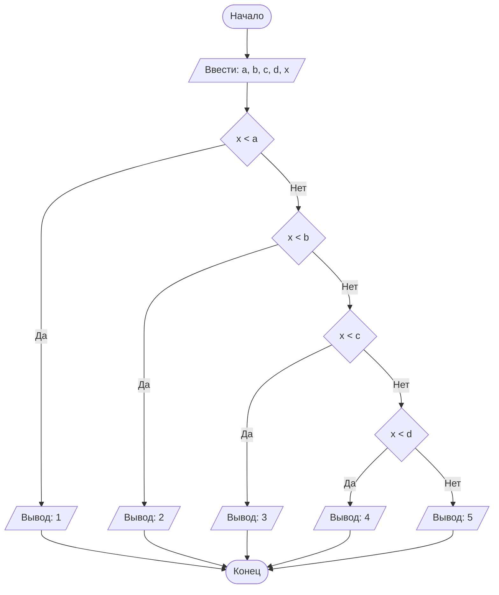

# Lab1
#### № группы: `ПМ-2501`

#### Выполнила: `Рогулина Екатерина Павловна`

#### Вариант: `19`

### Cодержание:

- [Постановка задачи](#1-постановка-задачи)
- [Входные и выходные данные](#2-входные-и-выходные-данные)
- [Выбор структуры данных](#3-выбор-структуры-данных)
- [Алгоритм](#4-алгоритм)
- [Программа](#5-программа)
- [Анализ правильности решения](#6-анализ-правильности-решения)

### 1. Постановка задачи

> Прогрмма получает на вход 4 различных, упорядоченных числа A, B, C и D (такие что A < B < C < D), которые делят числовую прямую на 5 участков (1, 2, 3, 4 и 5 слева направо), а также число X, не равное числам A, B, C и D. Нужно определить, какому участку принадлежит число X, путем последовательного сранения его с числами A, B, C и D.

### 2. Входные и выходные данные
#### Данные на вход:

Так как на входе программа получает 5 целых чисел, и по условию они не имеют верхних и нижних границ, будем считать что минамальное и максимальное значения будут равны минимальным и максимальным разрешенным в языке программирования, т.е. -2<sup>31</sup> и 2<sup>31</sup>-1:

|             | Тип         | min значение    | max значение     |
|-------------|-------------|-----------------|------------------|
| A (Число 1) | Целое число | -2<sup>31</sup> | 2<sup>31</sup>-1 |
| B (Число 2) | Целое число | -2<sup>31</sup> | 2<sup>31</sup>-1 |
| C (Число 3) | Целое число | -2<sup>31</sup> | 2<sup>31</sup>-1 |
| D (Число 4) | Целое число | -2<sup>31</sup> | 2<sup>31</sup>-1 |
| X (Число 5) | Целое число | -2<sup>31</sup> | 2<sup>31</sup>-1 |


#### Данные на выход
Т.к. программа должна вывести номер участка, которому принадлежит точка X, на выход мы получим одно натуральное число от 1 до 5:

|         | Тип               | min значение | max значение   |
|---------|-------------------|--------------|----------------|
| Число 1 | Натуральное число | 1            | 5              |

### 3. Выбор структуры данных

Программа получает 5 целых чисел. Поэтому для их хранения
можно выделить 5 переменных типа `int`:

|             | название переменной | Тип (в Java) | 
|-------------|---------------------|--------------|
| A (Число 1) | `a`                 | `int`        |
| B (Число 2) | `b`                 | `int`        |  
| C (Число 3) | `c`                 | `int`        |
| D (Число 4) | `d`                 | `int`        |
| X (Число 5) | `x`                 | `int`        |

Для вывода результата необязательно его хранить в отдельной переменной.

### 4. Алгоритм

1. **Ввод данных:**
  Программа считывает 5 целых чисел, обозначенных как `a`, `b`, `c`, `d` и `x`.

2. **Сравнение чисел:**
   Программа сравнивает значения `x` с остальными числами до тех пор, пока не найдется число большее `x`. В зависимости от этого числа определяется участок, на котором находится значени `x` (если `x<a` - участок 1, если `x<b` - участок 2, и т.д.).

3. **Вывод результата:**
   На экран выводится номер участка, на котором находится значение `x`.
  

#### Алгоритм выполнения программы:

#### Блок-схема:



### 5. Программа

```java
import java.util.Scanner;
public class Main {
    public static void main(String[] args) {
        //объявляем объект класса Scanner для ввода данных
        Scanner in = new Scanner(System.in);
        //вводим пять переменных
        System.out.print("Введите A: ");
        int a = in.nextInt();
        System.out.print("Введите B, большее A: ");
        int b = in.nextInt();
        System.out.print("Введите C,большее B: ");
        int c = in.nextInt();
        System.out.print("Введите D, большее C: ");
        int d = in.nextInt();
        System.out.print("Введите X, не равное A, B, C и D: ");
        int x = in.nextInt();
        if (x<a)
        //если x меньше a, он находиться на первом участке
            System.out.println(1);
        else
            if (x<b)
                //если х меньше b и при этом не находится на первом участке, он находится на втором участке
                System.out.println(2);
            else
                if (x<c)
                    //если х меньше с и при этом не находится ни на первом, ни на втором участке, он находится на третьем участке
                    System.out.println(3);
                else
                    if (x<d)
                        //если х меньше d и при этом ни находится на предыдущих участках, он находится на четвертом участке
                        System.out.println(4);
                    else
                        //если х не меньше d, а больше, значит, он находится на пятом участке
                        System.out.println(5);
    }
}
```

### 6. Анализ правильности решения

Программа работает корректно на всем множестве решений.

1. Тест на `X<A`:

    - **Input**:
        ```
        4 5 6 7 3
        ```

    - **Output**:
        ```
        1
        ```

2. Тест на `A<X<B`:

    - **Input**:
        ```
        10 30 40 50 20
        ```

    - **Output**:
        ```
        2
        ```

3. Тест на `B<X<C`:

    - **Input**:
        ```
        -10 -8 -6 -4 -7
        ```

    - **Output**:
        ```
        3
        ```

4. Тест на `C<X<D`:

    - **Input**:
        ```
        1 3 5 7 6
        ```

    - **Output**:
        ```
        4
        ```
5. Тест на `D<X`:

    - **Input**:
        ```
        11 22 33 44 55
        ```

    - **Output**:
        ```
        5
        ```
