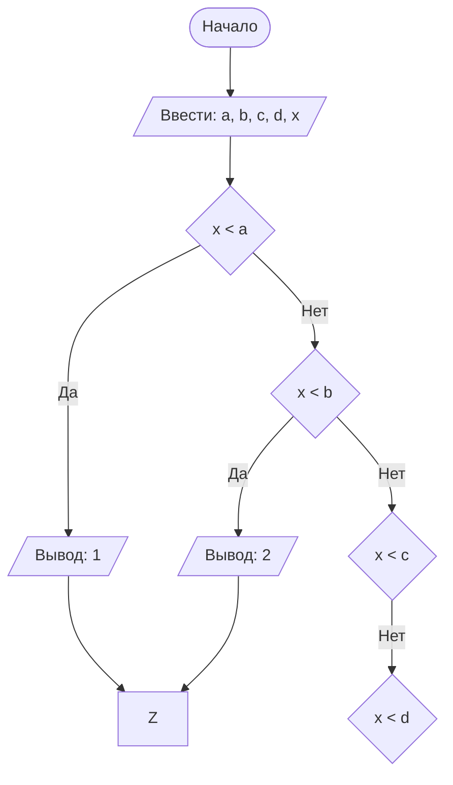

# Lab1
#### № группы: `ПМ-2501`

#### Выполнила: `Рогулина Екатерина Павловна`

#### Вариант: `19`

### Cодержание:

- [Постановка задачи](#1-постановка-задачи)
- [Входные и выходные данные](#2-входные-и-выходные-данные)
- [Выбор структуры данных](#3-выбор-структуры-данных)
- [Алгоритм](#4-алгоритм)
- [Программа](#5-программа)
- [Анализ правильности решения](#6-анализ-правильности-решения)

### 1. Постановка задачи

> 
>

### 2. Входные и выходные данные
#### Данные на вход:

Так как на входе программа получает 5 целых чисел, и по условию они не имеют верхних и нижних границ, будем считать что минамальное и максимальное значения будут равны минимальным и максимальным разрешенным в языке программирования, т.е. -2<sup>32</sup> и 2<sup>32</sup>:

|             | Тип         | min значение    | max значение   |
|-------------|-------------|-----------------|----------------|
| A (Число 1) | Целое число | -2<sup>32</sup> | 2<sup>32</sup> |
| B (Число 2) | Целое число | -2<sup>32</sup> | 2<sup>32</sup> |
| C (Число 3) | Целое число | -2<sup>32</sup> | 2<sup>32</sup> |
| D (Число 4) | Целое число | -2<sup>32</sup> | 2<sup>32</sup> |
| X (Число 5) | Целое число | -2<sup>32</sup> | 2<sup>32</sup> |


#### Данные на выход
Т.к. программа должна вывести номер участка, которому принадлежит точка X, на выход мы получим одно натуральное число от 1 до 5:

|         | Тип               | min значение | max значение   |
|---------|-------------------|--------------|----------------|
| Число 1 | Натуральное число | 1            | 5              |

### 3. Выбор структуры данных

Программа получает 5 целых чисел. Поэтому для их хранения
можно выделить 5 переменных типа `int`.

|             | название переменной | Тип (в Java) | 
|-------------|---------------------|--------------|
| A (Число 1) | `A`                 | `int`        |
| B (Число 2) | `B`                 | `int`        |  
| C (Число 3) | `C`                 | `int`        |
| D (Число 4) | `D`                 | `int`        |
| X (Число 5) | `X`                 | `int`        |

Для вывода результата необязательно его хранить в отдельной переменной.

### 4. Алгоритм

#### Алгоритм выполнения программы:

#### Блок-схема:



### 5. Программа

```java
import java.util.Scanner;
public class Main {
    public static void main(String[] args) {
        Scanner in = new Scanner(System.in);
        System.out.print("Введите A: ");
        int A = in.nextInt();
        System.out.print("Введите B, большее A: ");
        int B = in.nextInt();
        System.out.print("Введите C,большее B: ");
        int C = in.nextInt();
        System.out.print("Введите D, большее C: ");
        int D = in.nextInt();
        System.out.print("Введите X, не равное A, B, C и D: ");
        int X = in.nextInt();
        if (X<A)
            System.out.println("Участок: " + 1);
        else
            if (X<B)
                System.out.println("Участок: " + 2);
            else
                if (X<C)
                    System.out.println("Участок: " + 3);
                else
                    if (X<D)
                        System.out.println("Участок: " + 4);
                    else
                        System.out.println("Участок: " + 5);
    }
}
```

### 6. Анализ правильности решения
